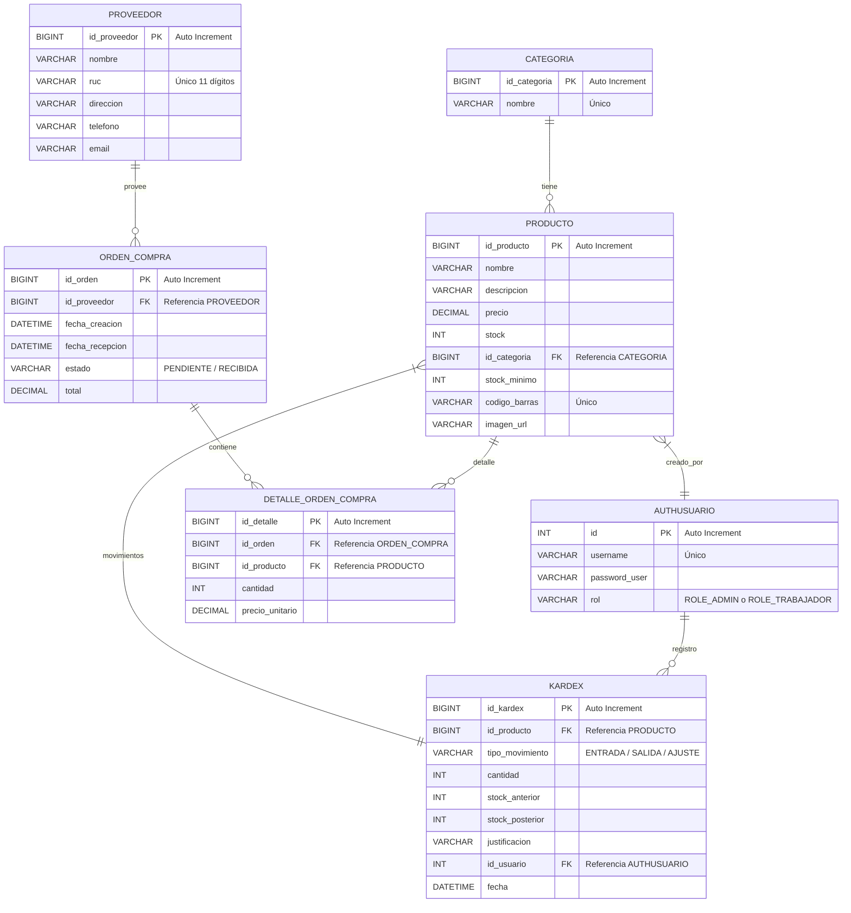

# 📊 Diagrama ER del modelo de datos

```mermaid
erDiagram
    CATEGORIA {
        BIGINT id_categoria PK "Auto Increment"
        VARCHAR nombre "Único"
    }
    AUTHUSUARIO {
        INT id PK "Auto Increment"
        VARCHAR username "Único"
        VARCHAR password_user
        VARCHAR rol "ROLE_ADMIN o ROLE_TRABAJADOR"
    }
    PRODUCTO {
        BIGINT id_producto PK "Auto Increment"
        VARCHAR nombre
        VARCHAR descripcion
        DECIMAL precio
        INT stock
        BIGINT id_categoria FK "Referencia CATEGORIA"
        INT stock_minimo
        VARCHAR codigo_barras "Único"
        VARCHAR imagen_url
    }
    PROVEEDOR {
        BIGINT id_proveedor PK "Auto Increment"
        VARCHAR nombre
        VARCHAR ruc "Único 11 dígitos"
        VARCHAR direccion
        VARCHAR telefono
        VARCHAR email
    }
    ORDEN_COMPRA {
        BIGINT id_orden PK "Auto Increment"
        BIGINT id_proveedor FK "Referencia PROVEEDOR"
        DATETIME fecha_creacion
        DATETIME fecha_recepcion
        VARCHAR estado "PENDIENTE / RECIBIDA"
        DECIMAL total
    }
    DETALLE_ORDEN_COMPRA {
        BIGINT id_detalle PK "Auto Increment"
        BIGINT id_orden FK "Referencia ORDEN_COMPRA"
        BIGINT id_producto FK "Referencia PRODUCTO"
        INT cantidad
        DECIMAL precio_unitario
    }
    KARDEX {
        BIGINT id_kardex PK "Auto Increment"
        BIGINT id_producto FK "Referencia PRODUCTO"
        VARCHAR tipo_movimiento "ENTRADA / SALIDA / AJUSTE"
        INT cantidad
        INT stock_anterior
        INT stock_posterior
        VARCHAR justificacion
        INT id_usuario FK "Referencia AUTHUSUARIO"
        DATETIME fecha
    }

    CATEGORIA ||--o{ PRODUCTO : "tiene"
    PRODUCTO }|--|| AUTHUSUARIO : "creado_por"
    PRODUCTO }|--|| KARDEX : "movimientos"
    PROVEEDOR ||--o{ ORDEN_COMPRA : "provee"
    ORDEN_COMPRA ||--o{ DETALLE_ORDEN_COMPRA : "contiene"
    PRODUCTO ||--o{ DETALLE_ORDEN_COMPRA : "detalle"
    AUTHUSUARIO ||--o{ KARDEX : "registro"
```

Este diagrama muestra las tablas principales, sus columnas clave y las relaciones de **uno‑a‑muchos** entre ellas.
